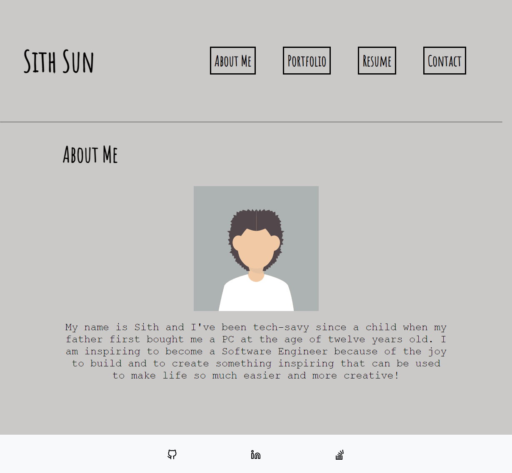

# React-Portfolio
  

This project was created with an interactive user experience towards my own portfolio. Experience React and performance web-based applications.

## Description
* Uses React to create front-end portfolio that will be hosted on gh-pages.
* Uses React-Carousel to portray user projects and personal apps.

## Table of Contents
- [Installation](#installation)
- [Usage](#usage)

- [Screenshot/Video](#screenshotvideo)
- [Deployed APP](#deployed-application)
- [Contributing](#contributing)
- [License](#license)
- [Questions](#questions)

## Installation
* _Run installation_:
> npm install

* _Run terminal_:
> npm start

## Usage
This application is showcase that user can work with React and display skills regarding usage and knowledge on how to run a front-end modern application.

## Screenshot/Video

## Deployed Application
*A list of links of deployed applications:*

- [React-Portfolio](https://sithhun.github.io/React-Portfolio)

## Contributing
*A list of contributors on this project includes:*

* [Sith Hun](https://github.com/SithHun)

*Third-party applications used to create this project:*
* [React](#)
* [react-responsive-carousel](#)
* [react-scripts](#)
* [react-router-dom](#)
* [react-dom](#)
* [gh-pages](#)
* [NodeJS](#)

## License
*This project is licensed under the MIT.*

## Questions
If you have any questions, you can reach out to me via GitHub: [@SithHun](https://github.com/SithHun)

Feel free to contact me via email: sithsun@gmail.com

 

> *Credits: This ReadMe was created with ❤️ by [Professional-ReadMe-Generator](https://github.com/SithHun/Professional-ReadMe-Generator)*
